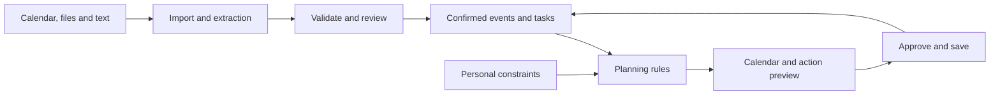

# Margin

### The calendar for your whole student life.

**CodeNection 2026 · Team uc-7-9 · Lifestyle Track: Beating the Burnout**

**Team:** Colin Leong Hong Seng, Mustafe Abdilahi Ahmed, Chan Xiang Wei, Khelvinjit Singh

**Problem Statement:** Stress & Workload Manager

Margin brings university work, part-time shifts, committee responsibilities and personal commitments into one plan. See what fits, understand what needs to change, and know what to do next.

[Ideation boards](docs/ideation.md) · [Technical design](docs/technical-design.md)

## 1. Project Overview

### The Problem

Student life arrives in fragments: assessment dates in a syllabus, shifts in a roster screenshot, club responsibilities in a group chat and appointments in a calendar. Bringing those sources together takes effort, and the resulting timetable still misses much of the work. A committee meeting needs preparation. An assignment needs several study sessions. A shift also needs travel time.

The problem becomes visible late, when several deadlines compete for the same few hours. Moving an appointment is not always possible: a lecturer sets a deadline, an employer sets a shift, and a committee task may depend on someone else's reply. Recovery and lower-priority personal responsibilities are easy to displace when the plan becomes crowded.

Our primary users are university students balancing coursework with committee roles and/or part-time employment. Committee members, classmates and employers are also stakeholders because some adjustments require their agreement. The concept grew from a team member's difficulty maintaining a whole-life planning system in Notion.

Existing products solve important parts of the problem. [Sunsama](https://help.sunsama.com/docs/usage-guides/daily-planning/) compares planned work against a configurable workload threshold and supports deferral. [Coursicle](https://www.coursicle.com/blog/how-to-add-your-syllabus-to-coursicle/) imports syllabuses into a student planner. Workload warnings and syllabus imports alone do not fulfil the workflow we are designing: mixed student-life inputs, the preparation behind commitments, several dimensions of load, and concrete actions when the student cannot change a commitment alone.

### Our Solution

Margin is an AI-assisted student calendar designed to turn syllabuses, shift rosters, committee messages and personal commitments into a workable plan. It connects fixed appointments with their preparation tasks, dependencies and deadlines, while showing time pressure and personal effort demands. Students can preview a new commitment and compare specific ways to move, batch, share or renegotiate work while protecting recovery time. A calendar and daily-action interface makes each proposed change understandable, reviewable and reversible.

### Feature Set

The following features define the proposed product and building-phase scope.

| Feature | What it helps the student do |
|---|---|
| **Life Inbox** | Bring in calendar events, syllabus PDFs, roster images and pasted responsibilities. |
| **Source review** | Confirm extracted dates, correct uncertainty and review suggested preparation tasks. |
| **Whole-life calendar** | Organise University, Work, Clubs/Committee and Personal commitments together. |
| **Preparation planning** | Reserve work sessions before deadlines, including travel and dependencies. |
| **Load overview** | Understand time pressure alongside mental, physical, social and errands/admin demands. |
| **Commitment preview** | See what accepting a new responsibility would displace before deciding. |
| **Rebalance** | Compare specific changes, their reasons, their effects and any remaining shortfall. |
| **Negotiation support** | Draft requests for help or changed commitments and track them as pending. |
| **Recovery and feedback** | Protect chosen personal time and update estimates when work takes longer. |
| **Personal settings** | Adjust life spaces, work windows, session lengths, buffers and notifications. |

## 2. Ideation & Process

### 2.1 Ideas We Considered

| Idea | Why it was kept or dropped |
|---|---|
| **Margin — chosen** | Directly addresses fragmented student workload and the difficulty of maintaining a whole-life plan. Imports, a calendar and actionable changes form a focused software workflow. |
| FairTrip | Group travel planning around budgets and preferences fits the travel track, but Margin is more closely connected to the student problem that motivated this project. |
| Plan B Pocket / Detour | Disruption-aware travel planning would depend on destination and availability data and moved away from the chosen student-workload focus. |
| Campus Reset | Nearby recovery activities could support students, but would address only one part of managing total load. |
| LoadShare | A student help and errand exchange could redistribute work, but introduces marketplace participation and matching requirements. Direct requests for help are a more contained feature. |
| Breather | Sensor-informed recovery spaces would require campus hardware deployment alongside the application. |
| QueueLess | Campus queue and errand timing was not a sufficiently compelling match for the central workload problem. |
| ShiftSync | Study–work conflict detection and shift swaps are relevant but cover only one part of student life. Negotiation remains useful within Margin. |
| Roomie | Household chore allocation was too narrow, and the proposed hardware did not add enough value. |
| PocketPort | An offline group travel hub addressed connectivity rather than the workload problem we selected. |
| StudySense | Desk sensors cannot reliably establish task identity, actual study time or mental strain. User-reported remaining work is a clearer starting point. |

### 2.2 Ideation Boards

The [ideation boards](docs/ideation.md) connect the problem causes, life areas, planning decisions and user actions. They include a concept map, a problem tree and a user flow, with a brief explanation of each.

The concept evolved through four decisions:

| Decision | Reason | Product change |
|---|---|---|
| Put the calendar at the centre | Students need to see when commitments happen and what action is possible. | Calendar and daily agenda become the main interface. |
| Include the whole student life | School, shifts, clubs and personal tasks share the same available time. | Customisable life spaces feed one combined plan. |
| Import the sources students already have | Manual setup and repeated transcription add maintenance work. | Syllabus, roster, text and calendar inputs enter a review inbox. |
| Make the consequences actionable | A warning does not change a deadline, resolve a dependency or create time. | Preparation tasks, what-if previews and specific change proposals explain the next step. |

## 3. Design & Prototype

The prototype phase focuses on the intended interface. Live extraction, calendar integration and scheduling logic are planned for the building phase.

### Core Experience

**Add your life → review commitments → see your calendar → preview a change → rebalance → act.**

| Screen | Interaction |
|---|---|
| **Life Inbox** | Add a syllabus, shift roster, committee message or calendar. |
| **Review imports** | Check source references, correct dates and choose suggested preparation tasks. |
| **Semester overview** | Identify a future week where commitments collide and inspect its causes. |
| **Week calendar** | See appointments, deadlines, work sessions and personal time alongside next actions. |
| **Commitment preview** | Preview a proposed shift or responsibility and its effect on the plan. |
| **Rebalance** | Compare changes, approve selected actions and distinguish pending requests from confirmed adjustments. |
| **Updated plan** | Follow a mobile agenda, undo a change or update remaining work. |
| **Personal settings** | Adjust life spaces, availability, work patterns and recovery preferences. |

On desktop, the calendar is paired with life-space filters and a focused “Needs attention” panel. On mobile, today's agenda and next actions take priority. Important statuses use text as well as colour, and essential actions have an alternative to dragging.

### Illustrative Planning Scenario

A student has eight compatible work hours before Friday noon, after classes, shifts, travel and protected personal time. Their intended work totals ten hours: a six-hour lab report, a three-hour committee deliverable and one hour of grocery shopping.

| State | Work to fit before Friday | Available time | Result |
|---|---:|---:|---|
| Original plan | 10 hours | 8 hours | 2-hour shortfall |
| Flexible groceries moved to Saturday | 9 hours | 8 hours | 1-hour shortfall remains |
| Two-hour committee handover requested | 9 hours | 8 hours | Request pending; obligation remains |
| Handover confirmed | 7 hours | 8 hours | 1 hour of buffer |

Moving groceries changes when they happen; it does not remove them from the week. A request for help changes the confirmed plan only after agreement. This scenario illustrates the intended interaction, rather than a measured user outcome.

## 4. What Makes It Different

**The work behind the event.** Margin proposes preparation and follow-up tasks for review, connecting the visible appointment to the effort it requires.

**The cost of the next yes.** A new commitment is evaluated against the work, deadlines and personal time it would displace.

**Changes with reasons.** Each suggestion identifies the affected task, the proposed action, the tradeoff and its effect on the plan. Students can compare and approve individual changes.

**Shared responsibilities stay realistic.** Shift swaps, delegation and extensions remain conditional until the student confirms agreement. If the work still cannot fit, that shortfall remains visible.

**Personal limits affect the plan.** Mental, physical, social and admin demands complement time availability. Preferences are editable, and visually hiding a life space never removes its commitments from planning.

Margin's proposed contribution is this combination of student context and interactions. The deployment phase will test its usefulness through actual planning tasks and repeated use.

## 5. Technical Architecture & Feasibility

### Planned Tech Stack

| Layer | Technology | Rationale and constraint |
|---|---|---|
| Frontend | React / Next.js with TypeScript | A single responsive application for phone and desktop; a mobile agenda keeps the interface usable on small screens. |
| Calendar UI | FullCalendar Standard | Reusable calendar components under its [MIT license](https://fullcalendar.io/license); premium-only features are outside the baseline. |
| Backend | TypeScript server routes and a planning module | Shared data definitions with scheduling logic that can be checked independently of AI output. |
| Database, auth and files | Supabase | Managed relational data and authentication with a [free tier](https://supabase.com/pricing); per-user access policies, storage quotas and inactivity pauses require attention. |
| AI extraction | Gemini API | [Document input](https://ai.google.dev/gemini-api/docs/document-processing) for heterogeneous source material; extraction quality, rate limits and [data-use terms](https://ai.google.dev/gemini-api/docs/pricing) guide model/tier selection. |
| Calendar integration | Google Calendar API and `.ics` | Read existing commitments using [scoped access](https://developers.google.com/workspace/calendar/api/auth); `.ics` remains a fallback for account-access limitations. |
| Hosting | Vercel | Public web deployment, with [plan eligibility and execution limits](https://vercel.com/docs/plans/hobby) checked against the demo workload. |

AI interprets documents and proposes tasks or messages. Application code validates dates, checks available slots and dependencies, calculates the effects of changes and saves approved plans. Source references and user corrections keep uncertain information reviewable.

The [technical design](docs/technical-design.md) details the data model, capacity calculation, scheduling rules, integration boundaries and acceptance checks.

### Build Plan & Scope

| Build period | Deliverable | Completion check |
|---|---|---|
| **21–27 September** | Persistent calendar/agenda, manual entry, PDF/text import review, settings and `.ics`; early Google access check | A student can confirm imported commitments and retain an accurate calendar. |
| **28 September–4 October** | Deadline scheduling, load overview, what-if preview, rebalancing, pending requests, approval/undo, roster images and Google read sync | The app explains a shortfall and proposes valid changes while preserving fixed commitments. |
| **5–11 October** | Failure handling, recurrence/time-zone tests, mobile/accessibility improvements, data isolation and deployment hardening | The core flow works on a real phone without a developer guiding it. |

The baseline covers calendar import, planning and reviewed changes. Selective write-back to a separate external calendar is stretch scope after read-sync reliability. Automatic LMS/email ingestion, full document workspaces, hardware, wearables and autonomous messaging are outside the initial build.

During the **12–31 October deployment phase**, a small consenting student pilot will assess time to a usable plan, import corrections, rule violations, accepted or edited suggestions, repeated use and perceived manageability. The team will record actual sample sizes and service costs. These measures test practical planning value; they do not establish a clinical burnout-prevention effect.
