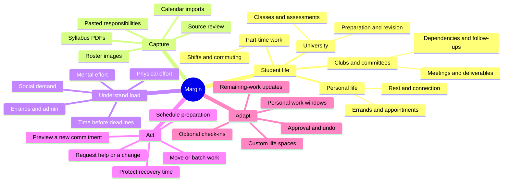
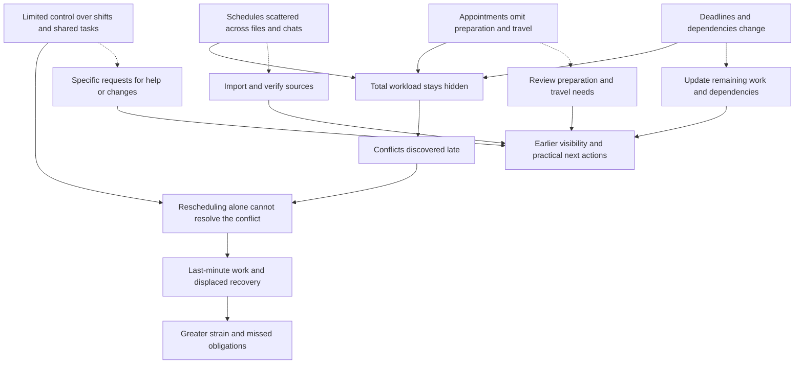
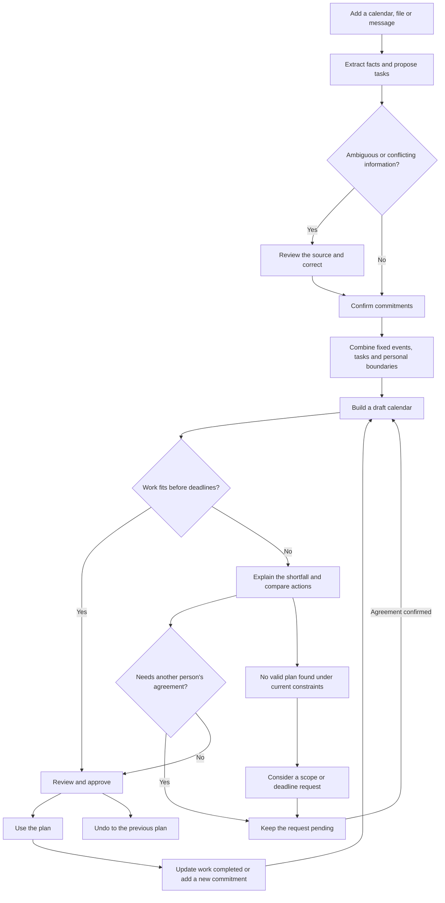

# Margin — Ideation Boards

[Back to project overview](../README.md)

## Concept Map

The map connects each part of student life to the information Margin needs and the actions it can propose. Life spaces organise responsibilities; load dimensions describe the demands those responsibilities place on the same student.

## Problem Tree

The problem tree links fragmented information and limited control to late planning conflicts. The intervention links explain why the product needs both a calendar and support for decisions involving other people.

## User Flow

The flow keeps uncertainty, infeasibility and external agreements visible. Approval commits a specific plan, while remaining-work updates make later replanning possible without restarting setup.

## Idea Evolution

The initial commitment-preview concept became a calendar-centred product when the discussion focused on daily use. Including school, work, clubs and personal responsibilities made total availability the shared constraint. Syllabus and roster imports followed from the need to reduce manual setup. Preparation tasks, dependencies and pending requests then sharpened the practical meaning of a workable plan.

These are concept refinements from the ideation process. The boards describe the proposed experience rather than observed outcomes from a deployed system.
